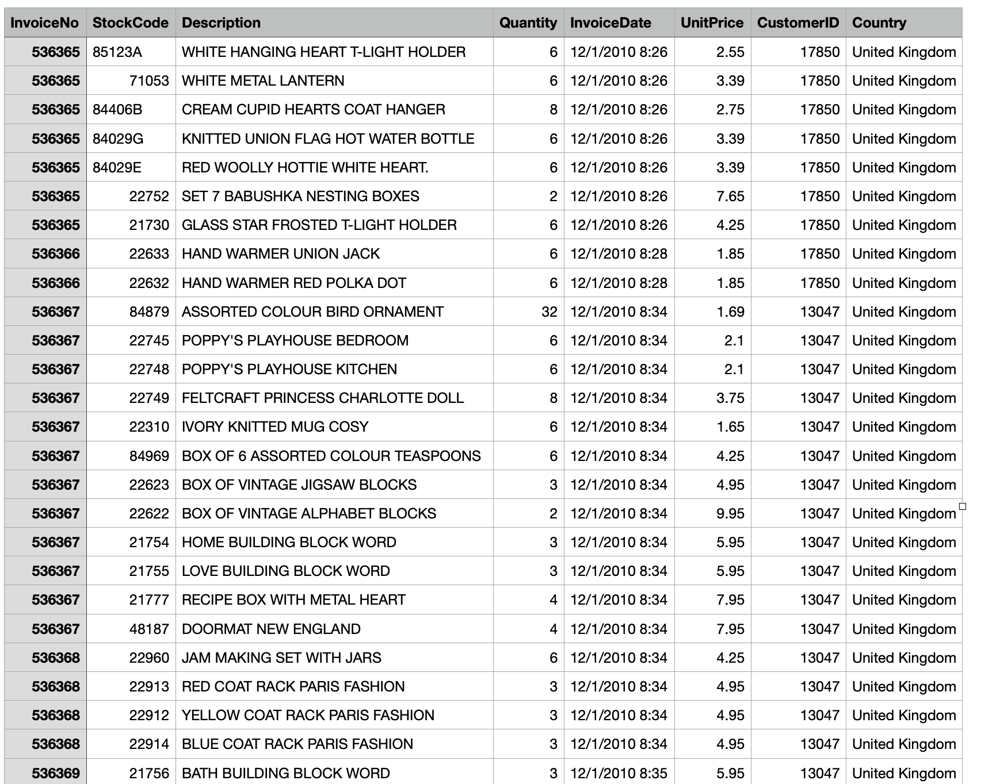
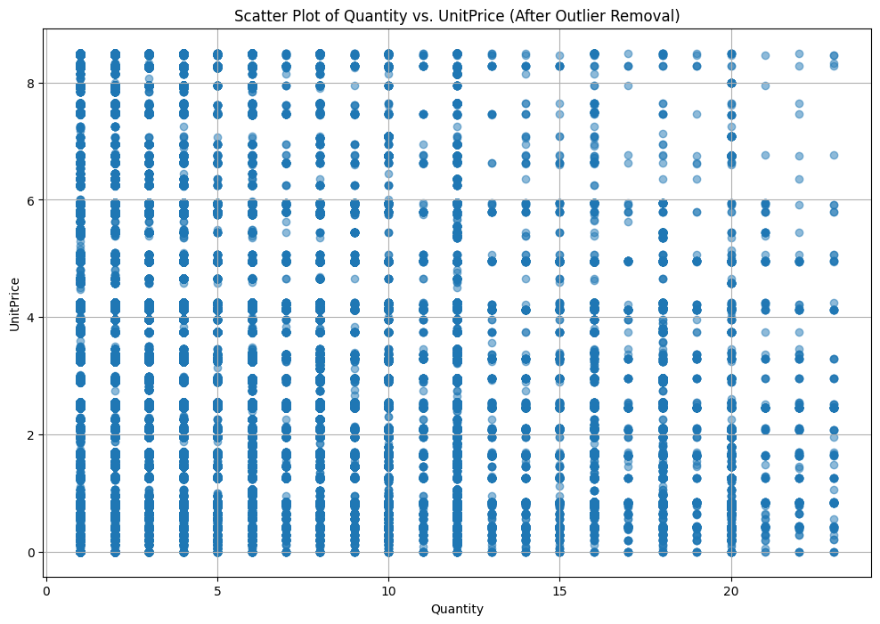

<!-- _class: lead -->

# Data Analyst Project
Analyzing Consumer Behavior in Online Retail: Insights from a UK E-Commerce Dataset


---
<!-- paginate: true -->
<!-- footer: Profesional Certificate Data Analytics - Lalitha Shamugam  -->

# Presenter

**Lalitha Shamugam**  

- [Google Scholar](https://scholar.google.com/citations?user=F-YH72IAAAAJ&hl=en) 

- [LinkedIn](https://www.linkedin.com/in/lalithashamugam/)

---
<!-- _class: lead -->

# Task I: Topic and Data Set 

---
## Data Set Info

- The dataset chosen is "E-commerce Data".
- It is available in the following [link](https://www.kaggle.com/datasets/carrie1/ecommerce-data/data).



---
## Data Set Description

1. This dataset contains actual transaction data from a UK-based online retail store.
2. It contains transaction data from November 2010 to December 2011.
3. There are approximately 500,000 records.

---
## Data Set Attributes

- InvoiceNo: Invoice number (a unique identifier for each transaction)
- StockCode: Product code
- Description: Product description
- Quantity: Quantity of product purchased
- InvoiceDate: Date and time of purchase
- UnitPrice: Product price per unit
- CustomerID: Unique customer identifier
- Country: Country from where the order was placed

---
## Read File 

```py
# import library
import pandas as pd

# read file
data = pd.read_csv('data.csv',encoding = "ISO-8859-1")

# view file
data.head()
```

---
## Basic Info

```py
# find data info
data.info()
```


---
## Statistical Description

```py
# statistical description
data.describe(include='all')
```


---
## Potential Business Hypothesis

Quantity and UnitPrice Relationship:

- Hypothesis: There is a relationship between the quantity of a product sold and its unit price

- Dependent Variable: Quantity

- Independent Variable: UnitPrice

---
<!-- _class: lead -->

# Task II: Data Analysis & Prediction

---
## Handling Missing Values
- No missing value found in Quantity and UnitPrice

```py
# find missing value
missing_values = data.isnull().sum()
missing_values
```


---
## Handling Outlier
To detect outliers in the "Quantity" and "UnitPrice" columns, we can use the Interquartile Range (IQR) method. This involves:
1. Calculating the first (Q1) and third quartiles (Q3) for each column.
2. Determining the IQR, which is the difference between Q3 and Q1.
3. Identifying outliers as values that fall below Q1−1.5×IQR or above Q3+1.5×IQR.

---
## Handling Outlier
Based on the Interquartile Range (IQR) method:

- There are 58,619 outliers detected in the "Quantity" column.
- There are 39,627 outliers detected in the "UnitPrice" column.


---

## Scatter Plot
- It is difficult to observe any pattern or linear relationship.
- Clearly this will have no or weak relationship.


---
## Testing Relationship 
```py
# find Pearson correlation coeeficient
correlation_coefficient = data_cleaned["Quantity"].corr(data_cleaned["UnitPrice"])

correlation_coefficient
```

- The Pearson correlation coefficient between "Quantity" and "UnitPrice" in the cleaned dataset is approximately −0.2805

- This indicates a weak negative correlation between the two variables. As the quantity increases, the unit price tends to decrease slightly (and vice versa), but the relationship is not very strong.

---
## Updated Business Hypothesis

Quantity and TotalSales Relationship:

- Hypothesis: There is a relationship between the quantity of a product sold and its total sales

- Dependent Variable: Quantity

- Independent Variable: TotalSales


---
## Feature Engineering: TotalSales

The new variable, "TotalSales", will be computed as:

$TotalSales = Quantity × UnitPrice$   

```py
# Create the new "TotalSales" variable
data_cleaned["TotalSales"] = data_cleaned["Quantity"] * data_cleaned["UnitPrice"]

# Display the first few rows of the dataset with the new variable
data_cleaned.head()
```

---
## Scatter Plot
- Now, the linear relationship is much more visible.
- Clearly this will have moderate or strong positive linear relationship.


---
## Testing Relationship 
```py
# Compute the Pearson correlation coefficient between "Quantity" and "TotalSales" 
correlation_total_sales_quantity = data_cleaned["TotalSales"].corr(data_cleaned["Quantity"])

correlation_total_sales_quantity
```

- The Pearson correlation coefficient between "Quantity" and "TotalSales" in the cleaned dataset is approximately 0.6062.

- This indicates a moderate positive correlation between the two variables. As the quantity increases, the total sales also tend to increase, which is expected since "TotalSales" is derived from "Quantity" (among other factors).

---
## Result
- There is moderate positive correlation between "Quantity" and "TotalSales" 


---
## New Cleaned Dataset

```py
# View new cleaned data
data_cleaned.head()
```


---
<!-- _class: lead -->

# Task III: Results Visualisation

---
## New Cleaned Dataset
- We will take the cleaned data and generate few visualisation using Tableau  

---
## Bar Chart


---
