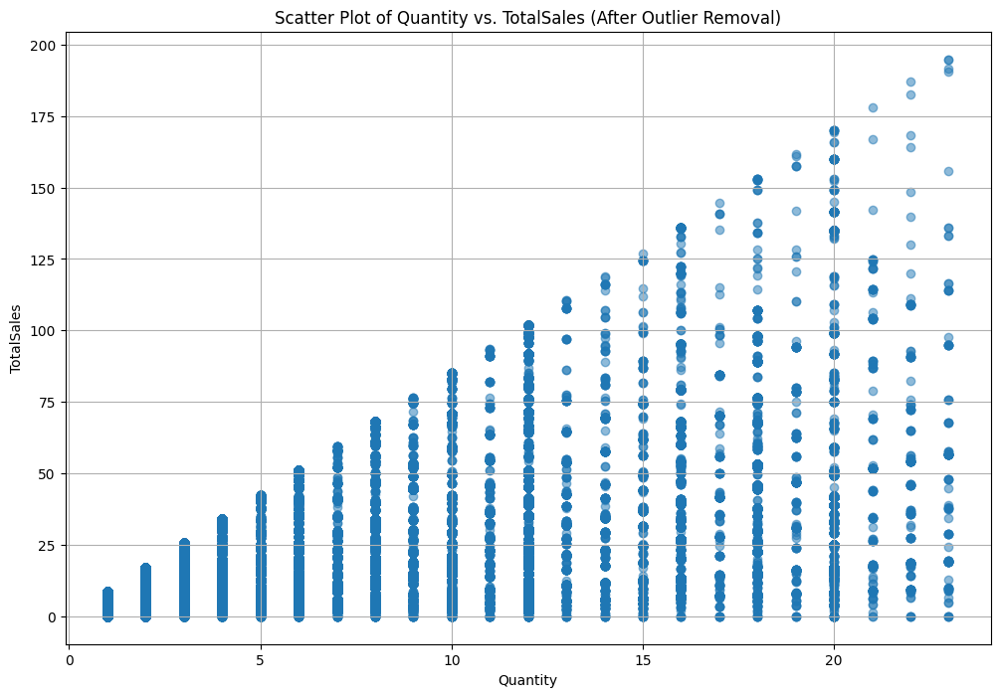

<!-- _class: lead -->

## Analyzing Consumer Behavior in Online Retail: Insights from a UK E-Commerce Dataset
Profesional Certificate Data Analytics (SP-ZG001)

---
<!-- paginate: true -->
<!-- footer: Data Analyst Project - Lalitha Shamugam  -->

# Presenter

**Lalitha Shamugam**  

- [Google Scholar](https://scholar.google.com/citations?user=F-YH72IAAAAJ&hl=en) 

- [LinkedIn](https://www.linkedin.com/in/lalithashamugam/)

**Materials**
- Jupyter Notebook, Dataset, Slides --> [GitHub](https://github.com/lalitha1910/DataAnalyticsProject) 

- Visualisation, Dahsboard, Story --> [Tableau Dashboard](https://public.tableau.com/views/AnalyzingConsumerBehavior/Story1?:language=en-GB&:display_count=n&:origin=viz_share_link) 

---

<!-- _class: lead -->

# Task I: Topic and Dataset 

---
## Dataset Info

- The dataset chosen is "E-commerce Data".
- It is available in the following [link](https://www.kaggle.com/datasets/carrie1/ecommerce-data/data).


---
## Dataset Description

1. This dataset contains actual transaction data from a UK-based online retail store.
2. It contains transaction data from **November 2010** to **December 2011**.
3. There are approximately **500,000** records.

---
## Dataset Attributes

- **InvoiceNo**: *Invoice number (a unique identifier)*
- **StockCode**: *Product code*
- **Description**: *Product description*
- **Quantity**: *Quantity of product purchased*
- **InvoiceDate**: *Date and time of purchase*
- **UnitPrice**: *Product price per unit*
- **CustomerID**: *Unique customer identifier*
- **Country**: *Country from where the order was placed*

---
## Read File 
- Import the CSV file as a DataFrame using the pandas library.

```py
# import library
import pandas as pd

# read file
data = pd.read_csv('data.csv',encoding = "ISO-8859-1")

# view file
data.head()
```

---
## Basic Info

- The info() method in pandas was used to inspect the details.

```py
# find data info
data.info()
```


---
## Statistical Description

- The describe() method was used to obtain a statistical summary.

```py
# statistical description
data.describe(include='all')
```


---
## Potential Business Hypothesis

*Quantity* and *UnitPrice* Relationship:

- **Hypothesis**: *There is a relationship between the quantity of a product sold and its unit price*

- **Dependent Variable**: *Quantity*

- **Independent Variable**: *UnitPrice*

---
<!-- _class: lead -->

# Task II: Data Analysis & Prediction

---
## Handling Missing Values
- No missing value found in *Quantity* and *UnitPrice*.

```py
# find missing value
missing_values = data.isnull().sum()
missing_values
```


---
## Removing Outlier
Outlier Detection Method
- To detect outliers in the *Quantity* and *UnitPrice* columns, the **Interquartile Range (IQR)** method was used. 

Based on the **IQR** method:

- *Quantity* = **58,619** outliers detected/ removed 
- *UnitPrice* = **39,627** outliers detected/ removed 

---

## Removing Unusual Values 

Negative values in the *Quantity* can represent a few different scenarios:

1. Returns or Cancellations

2. Discounts or Adjustments

3. Data Entry Errors

```py
# Remove rows where "Quantity" is negative
data_cleaned = data_cleaned[data_cleaned["Quantity"] >= 0]
```


---

## Scatter Plot
- It is difficult to observe any pattern or linear relationship.
- Clearly, this will have no or weak relationship.


---
## Testing Relationship 
```py
# find Pearson correlation coeeficient
correlation_coefficient = data_cleaned["Quantity"].corr(data_cleaned["UnitPrice"])
```

- The Pearson correlation coefficient between *Quantity* and *UnitPrice* in the cleaned dataset is approximately **-0.294**

- This indicates a **weak negative correlation** between the two variables. 

- As the quantity increases, the unit price tends to decrease slightly.

---
## Updated Business Hypothesis

*Quantity* and *TotalSales* Relationship:

- **Hypothesis**: *There is a relationship between the quantity of a product sold and its total sales*

- **Dependent Variable**: *Quantity*

- **Independent Variable**: *TotalSales*


---
## Feature Engineering: TotalSales

The new variable, *TotalSales*, will be computed as:

$$TotalSales = Quantity × UnitPrice$$  

```py
# Create the new "TotalSales" variable
data_cleaned["TotalSales"] = data_cleaned["Quantity"] * data_cleaned["UnitPrice"]

# Display the first few rows of the dataset with the new variable
data_cleaned.head()
```

---
## Scatter Plot
- Now, the linear relationship is much more visible.
- Clearly, this will have moderate or strong positive linear relationship.


---
## Testing Relationship 
```py
# Compute the Pearson correlation coefficient between "Quantity" and "TotalSales" 
correlation_total_sales_quantity = data_cleaned["TotalSales"].corr(data_cleaned["Quantity"])
```

- The Pearson correlation coefficient between *Quantity* and *TotalSales* in the cleaned dataset is approximately **0.588**.

- This indicates a **moderate positive correlation** between the two variables. 
- As the quantity increases, the total sales also tend to increase, which is expected since *TotalSales* is derived from *Quantity*.

---

## New Cleaned Dataset

```py
# View new cleaned data
data_cleaned.head()
```


---
## Prediction

- Predictions were made using a Simple Linear Regression (SLR) model.


---
## Model Evaluation: $R^2$

- The $R^2$ score, or coefficient of determination, measures how well the independent variables explain the variation in the dependent variable.
- For this model, the $R^2$ score is approximately **0.346**.
- This means that around **34.6%** of the variation in *TotalSales* can be explained by *Quantity*.
- While this shows some level of correlation, it suggests that other features not included in the model might also be influencing *TotalSales*.

---
## Model Evaluation: MSE 

- The Mean Squared Error (MSE) quantifies the average squared difference between the predicted and actual values.
- For this model, the MSE is approximately **90.66**.
- An MSE value closer to zero indicates better model performance and more precise predictions.
- The relatively higher MSE of **90.66** suggests that there is room for improvement in the model's predictions, as the predicted values deviate from the actual values to some extent.

---
## Enhancing Model Performance

1. **Incorporate Additional Variables:**
Integrate other relevant features, such as product category, time of purchase, or customer demographics, which may provide additional insights into total sales.

2. **Address Negative Values in Quantity:**
Investigate the context and reasons behind negative values in the *Quantity* variable.

---
<!-- _class: lead -->

# Task III: Results Visualisation

---

## TotalSales for UK vs Non-UK

- Sales figures indicate that the UK accounts for a larger proportion of sales compared to other regions. 
- It would be strategic to focus marketing efforts on customers within the UK to capitalize on this trend.


---
## Purchase Months vs TotalSales & UnitPrice 

- There is a substantial increase in customer shopping activity during the Autumn season (Sept - Nov). This surge attributed to consumers preparing for the upcoming Winter. 
- Sales experience a sharp decline at the onset of Winter.


---
## Quantity vs TotalSales

- There is a moderate positive correlation between the quantity of a product sold and its total sales.


---
## Tableau Dashboard


